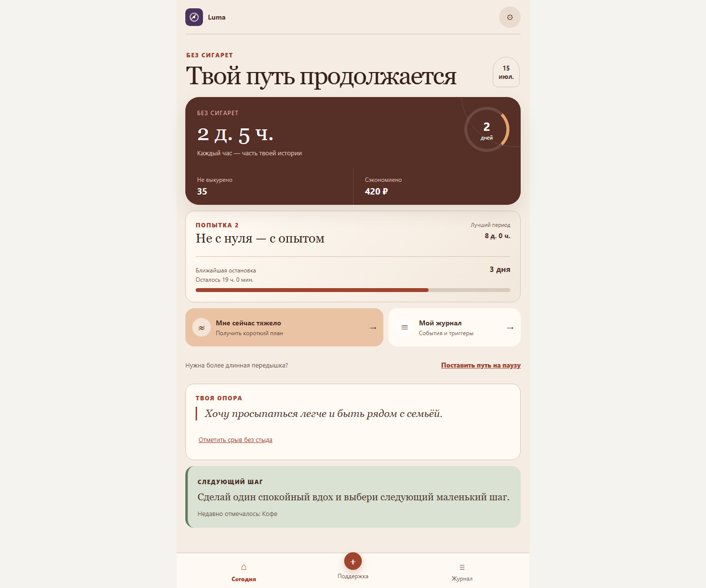
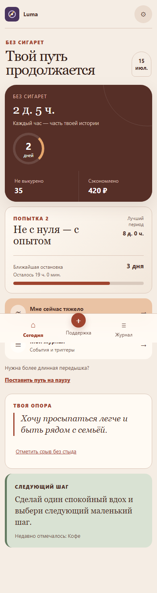
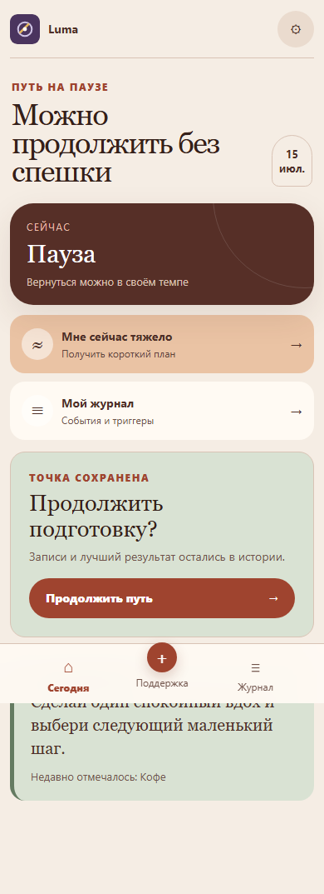

<div align="center">
  
  <h1>Luma</h1>
  <p><strong>Спокойный цифровой помощник на пути к жизни без сигарет.</strong></p>
  <p>Без стыда, давления и обещаний невозможного — только следующий честный шаг.</p>

  [](https://github.com/igordinskiy-ui/luma/actions/workflows/ci.yml)
  
  
  
</div>



## О продукте

Luma помогает пройти путь от последней пачки к устойчивой жизни без сигарет. Продукт соединяет Telegram Mini App и устанавливаемое PWA: человек может быстро отметить тягу или сигарету, получить короткую поддержку, увидеть накопленный прогресс и продолжить путь после сложного дня без ощущения, что всё потеряно.

Это не медицинское приложение и не замена врачу. Luma не ставит диагнозы, не назначает лечение и не гарантирует отказ от курения. Продукт создаёт бережную среду для самонаблюдения и небольших поведенческих действий.

## Что умеет Luma

| Возможность | Что получает пользователь |
| --- | --- |
| **Личный маршрут** | Подготовка, последняя пачка, отказ, пауза и возвращение без обнуления истории. |
| **Помощь в момент тяги** | Короткий сценарий на несколько минут: спокойный выдох, вода или смена пространства. |
| **Честный прогресс** | Время без сигарет, лучший период, количество невыкуренных сигарет и сэкономленные деньги. |
| **Журнал** | Хронология сигарет, тяги, триггеров и поддерживающих пауз без преждевременных выводов. |
| **Telegram + PWA** | Быстрый вход из Telegram и полноценный адаптивный веб-интерфейс с offline-поддержкой. |
| **Приватность по умолчанию** | Экспорт и удаление данных, версионированное согласие, минимизация аналитики и ограниченные сроки хранения. |

<div align="center">
  
  &nbsp;&nbsp;
  
</div>

## Принципы продукта

- **История не обнуляется.** Сложный день или новая попытка не стирают уже пройденное.
- **Действие важнее оценки.** Вместо красных предупреждений пользователь получает один выполнимый шаг.
- **Данные не притворяются выводами.** Журнал показывает наблюдения только тогда, когда их достаточно.
- **Безопасность — часть сценария.** Production запускается закрытым по умолчанию, а публичный доступ требует отдельных content/legal gate-ов.
- **Один визуальный язык.** Тёплая редакционная эстетика «Путь» работает одинаково в Telegram, PWA, на телефоне и десктопе.

## Как устроено

```text
Telegram Mini App / PWA
          │
      Caddy + HTTPS
          │
   React/Vite ── FastAPI
                    │
          PostgreSQL + Redis
                    │
          outbox worker → Telegram / Web Push
```

- `apps/web` — React 19, TypeScript, Vite, Vitest и Playwright.
- `apps/api` — FastAPI, SQLAlchemy, Alembic, PostgreSQL и Redis.
- `deploy` — Caddy и production-настройки reverse proxy.
- `.github/workflows/ci.yml` — тесты, сборка, dependency/secret/config scans и проверка контейнеров.

Архитектура разделяет публичный edge, приложение, stateful-сервисы и исходящий трафик. Production-контейнеры запускаются read-only, без лишних capabilities; PostgreSQL и Redis не публикуются наружу.

## Локальный запуск

Требуются Docker и Docker Compose.

```bash
cp .env.example .env
docker compose up --build
```

После запуска:

- веб-приложение — `http://localhost:5173`;
- OpenAPI — `http://localhost:8000/docs`;
- health-check — `http://localhost:8000/health`.

Для разработки без Docker используются Python 3.12 и Node.js 22:

```bash
cd apps/api && python -m pip install -r requirements.txt pytest
cd apps/web && npm ci && npm test && npm run build
```

## Production и первый VPS-деплой

Production имеет два явных режима:

1. `PUBLIC_LAUNCH_ENABLED=false` — безопасный preview для первого деплоя. HTTPS, БД, Redis, миграции, landing page и health-checks работают, но пользовательский API, вход и уведомления закрыты.
2. `PUBLIC_LAUNCH_ENABLED=true` — публичный запуск. Он разрешён только после утверждения пользовательского контента и юридических документов с точным совпадением digest-значений.

Перед развёртыванием выполните:

```bash
python scripts/release_preflight.py
docker compose -f docker-compose.yml -f docker-compose.prod.yml up -d --build
```

Секреты не хранятся в Git. Для GitHub → VPS deployment используйте GitHub Environments/Secrets и защищённый `.env` на сервере. Полный контракт переменных находится в [Production environment](docs/PRODUCTION_ENVIRONMENT.md), пошаговые операции — в [Operations runbook](docs/OPERATIONS_RUNBOOK.md).

> Публичный запуск пока намеренно закрыт: контент ожидает профильного review, а политика конфиденциальности и условия — утверждения владельцем и юридической проверки. Инфраструктурный preview можно разворачивать уже сейчас.

## Качество

Репозиторий содержит unit-, integration- и end-to-end тесты, accessibility-проверки, offline/error-state сценарии, миграции и release preflight. CI также проверяет закрепление GitHub Actions по commit SHA, зависимости, секреты, misconfiguration и container images.

## Документация

- [Production environment](docs/PRODUCTION_ENVIRONMENT.md)
- [Operations runbook](docs/OPERATIONS_RUNBOOK.md)
- [Production deploy runner](docs/DEPLOY_RUNNER.md)
- [Release checklist](docs/RELEASE_CHECKLIST.md)
- [Authentication ADR](docs/ADR-001-authentication.md)
- [Design system ADR](docs/ADR-002-path-design-system.md)
- [Telegram setup](docs/TELEGRAM_SETUP.md)
- [Isolated local product preview](docs/LOCAL_TEST_PREVIEW.md)

---

<div align="center"><strong>Luma помогает не начинать заново — а продолжать с опытом.</strong></div>
